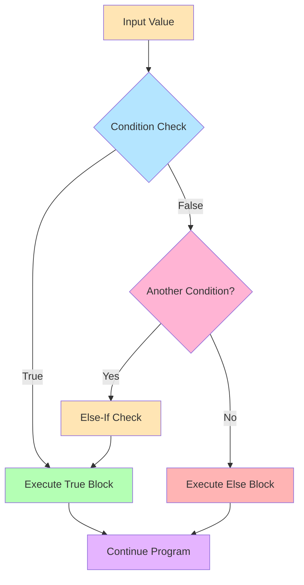
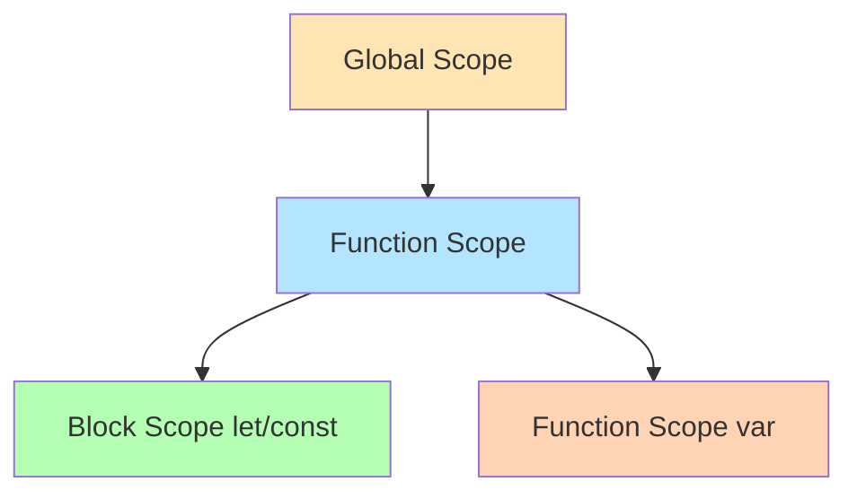
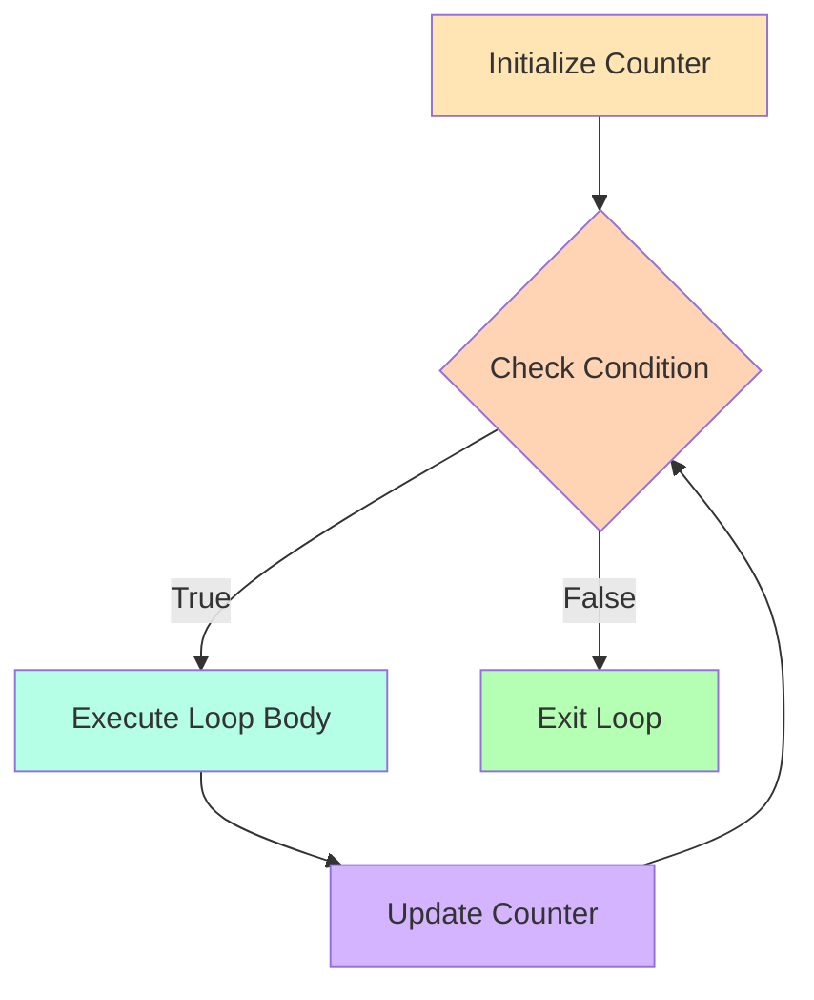
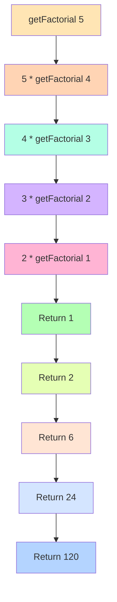
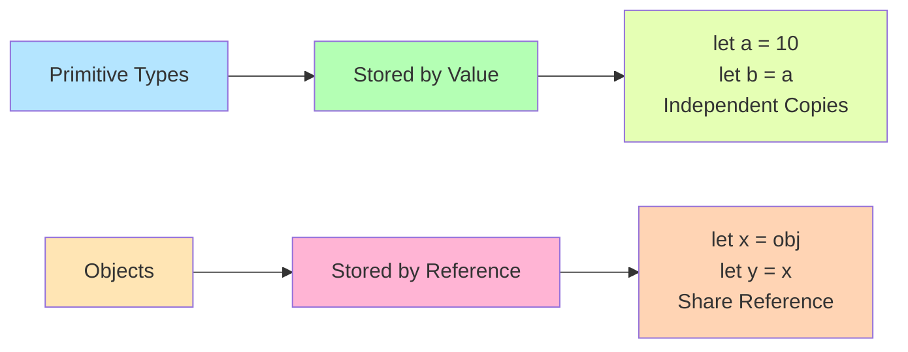
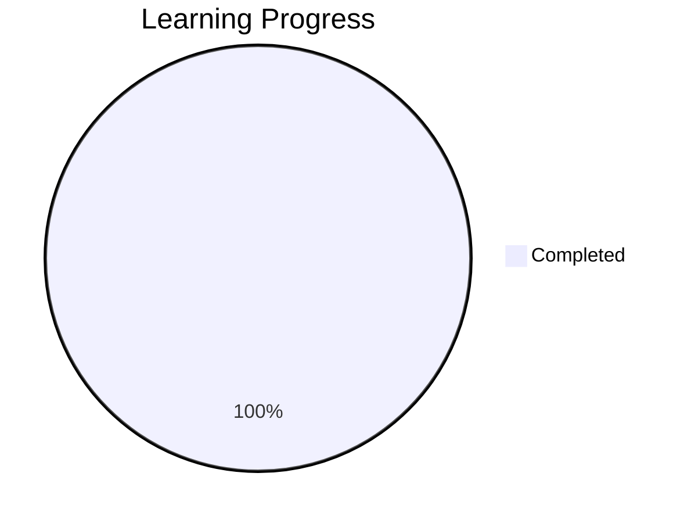

<div align="center">

# 📚 Learning JavaScript - Complete Journey


*A comprehensive repository dedicated to mastering JavaScript from fundamentals to advanced concepts*

[🚀 Getting Started](#-getting-started) • [📖 Chapters](#-chapters-overview) • [🎯 Questions](#-practice-questions) • [📊 Progress](#-learning-progress)

</div>

---

## 📋 Table of Contents

- [Overview](#-overview)
- [Learning Path](#-learning-path)
- [Chapters Overview](#-chapters-overview)
- [Practice Questions](#-practice-questions)
- [Key Concepts Covered](#-key-concepts-covered)
- [Getting Started](#-getting-started)
- [Learning Progress](#-learning-progress)
- [Resources](#-resources)

---

## 🌟 Overview

This repository is my personal learning journey through JavaScript, featuring **hands-on code examples**, **practical exercises**, and **mini-projects** covering everything from basic syntax to advanced programming concepts.

### 🎯 Goals
- ✅ Master JavaScript fundamentals
- ✅ Understand ES6+ modern syntax
- ✅ Build interactive web applications
- ✅ Practice problem-solving with real-world scenarios
- ✅ Create a comprehensive reference library

---

## 🗺️ Learning Path


---

## 📖 Chapters Overview

### 📘 Chapter 0: Introduction to JavaScript
*Laying the foundation for JavaScript programming*
- Understanding JavaScript's role in web development
- Browser console basics
- JavaScript ecosystem overview

---

### 📗 Chapter 1: JS Setup and First Code
**File:** [`index.html`](Chapter%201(JS%20Setup%20and%20First%20Code)/index.html)

🔑 **Key Learnings:**
- ✨ Internal JavaScript embedding
- 🎨 DOM manipulation basics
- 🖱️ Event handling (`onclick`)
- 📝 User interaction with `prompt()`
- 🎯 Dynamic content updates

**Interactive Features:**
```javascript
✓ Button click events
✓ Background color changer
✓ Dynamic text modification
✓ Console logging
```

---

### 📙 Chapter 2: Arithmetic Operators and Types
**File:** [`script.js`](Chapter%202(Arithemetic%20Operator%20and%20Types)/script.js)

🔢 **Topics Covered:**
- ➕ Arithmetic operators (`+`, `-`, `*`, `/`, `%`)
- 🔤 String concatenation
- 🔄 Type coercion and conversion
- 📊 Data types (`string`, `number`, `boolean`, `null`, `undefined`)
- 🧮 `typeof` operator
- 🎲 Math operations and rounding

**Code Examples:**
```javascript
console.log(10 / 3);           // Floating point
console.log(Math.round(10/3)); // Rounding
console.log("Hello" + true);   // Type coercion
console.log(typeof(12));       // Type checking
```

---

### 📕 Chapter 3: Variables and Mini Project
**File:** [`index.html`](Chapter%203(Variables%20and%20MiniProject)/index.html)

💾 **Core Concepts:**
- 🔖 Variable declaration (`var`, `let`, `const`)
- 📏 Naming conventions (camelCase)
- 🔄 Variable reassignment
- 🔒 Constants (`const`)
- 🧪 Practical calculations

**Real-world Example:**
```javascript
const pi = 3.14;
let radius = 5;
let area = pi * radius * radius;
// Calculate circle area with different radii
```

---

### 📘 Chapter 4: Decision Control
**Files:** 8 comprehensive JavaScript files

<details>
<summary>📂 Click to expand all Decision Control topics</summary>

#### 1️⃣ [`comparison-operator.js`](Chapter%204(Decision%20Control)/comparison-operator.js)
- Comparison operators (`===`, `>=`, `<=`, `!=`)
- If-else statements
- Truthy and falsy values

#### 2️⃣ [`if-else-if.js`](Chapter%204(Decision%20Control)/if-else-if.js)
- Multi-condition branching
- Grade calculation system
- Nested conditions

#### 3️⃣ [`nested-if.js`](Chapter%204(Decision%20Control)/nested-if.js)
- Nested if statements
- Number classification (positive/negative, even/odd)

#### 4️⃣ [`logical.js`](Chapter%204(Decision%20Control)/logical.js)
- Logical operators (`&&`, `||`, `!`)
- Complex conditions
- Code optimization with logical operators

#### 5️⃣ [`switch.js`](Chapter%204(Decision%20Control)/switch.js)
- Switch-case statements
- Day of the week program
- Default cases

#### 6️⃣ [`if-alternatives.js`](Chapter%204(Decision%20Control)/if-alternatives.js)
- Ternary operator (`? :`)
- OR operator (`||`) for default values
- Nullish coalescing operator (`??`)

#### 7️⃣ [`template-literal.js`](Chapter%204(Decision%20Control)/template-literal.js)
- Template literals (backticks)
- String interpolation (`${expression}`)
- Multi-line strings

</details>

**Decision Making Flow:**


---

### 📗 Chapter 5: Functions
**Files:** 3 essential function concepts

| File | Concept | Key Learning |
|------|---------|--------------|
| [`function.js`](Chapter%205(Functions)/scripts/function.js) | Function basics | Declaration, parameters, return values, random number generation |
| [`call-by-value.js`](Chapter%205(Functions)/scripts/call-by-value.js) | Call by value | Primitive types passed by value |
| [`scope.js`](Chapter%205(Functions)/scripts/scope.js) | Variable scope | var vs let, hoisting, global vs local scope |

**Function Concepts:**
```javascript
// Function declaration
function getSum(num1, num2) {
  return num1 + num2;
}

// Variable scope
var x = 10;    // Function scoped
let y = 5;     // Block scoped
global = 22;   // Global scope
```

**Scope Hierarchy:**


---

### 📙 Chapter 6: Loops
**File:** [`loop.js`](Chapter%206(Loops)/scripts/loop.js)

🔁 **Loop Fundamentals:**
- While loop structure
- Loop initialization
- Condition checking
- Update/increment
- Iteration control

**Loop Structure:**
```javascript
let num = 1;              // ① Initialization
while (num <= 50) {       // ② Condition
  console.log(num);       // ③ Loop body
  num++;                  // ④ Update
}
```

**While Loop Flow:**


---

### 📕 Chapter 7: Type Coercion and Memory Management
**Files:** [`script.js`](Chapter%207(Type_Coercion_and_Memory_Management)/script.js) | [`recursion.js`](Chapter%207(Type_Coercion_and_Memory_Management)/recursion.js)

🧠 **Advanced Concepts:**
- 🔄 Type coercion in JavaScript
- 📊 Implicit vs explicit type conversion
- 🔁 Recursion fundamentals
- 🎯 Base case and recursive case
- ⚡ Call stack visualization
- 🧮 Factorial calculation (iterative vs recursive)

**Type Coercion Examples:**
```javascript
console.log('Hi' + 44);    // 'Hi44' - String concatenation
console.log('66' - 44);    // 22 - Numeric subtraction
console.log(true == 2);    // false - Type coercion
```

**Recursion Example:**
```javascript
function getFactorial(num) {
  if (num === 1 || num === 0) return 1;  // Base case
  return num * getFactorial(num - 1);     // Recursive case
}

getFactorial(5);  // 120
```

**Recursion Call Stack:**


---

### 📘 Chapter 8: Objects
**Files:** 4 comprehensive object-oriented files

<details>
<summary>📂 Click to expand all Object topics</summary>

#### 1️⃣ [`object.js`](Chapter%208(Objects)/object.js)
- Object creation and structure
- Property access (dot vs bracket notation)
- Nested objects
- Adding/modifying/deleting properties
- Object as key-value pairs

#### 2️⃣ [`method.js`](Chapter%208(Objects)/method.js)
- Methods in objects
- `this` keyword usage
- Encapsulating functionality
- Object-oriented calculations

#### 3️⃣ [`reference.js`](Chapter%208(Objects)/reference.js)
- Call by value vs call by reference
- Object reference behavior
- Comparing objects
- Memory management

#### 4️⃣ [`reference_in_function.js`](Chapter%208(Objects)/reference_in_function.js)
- Passing objects to functions
- Object mutation in functions
- String objects and methods
- Immutability concepts

</details>

**Object Concepts:**
```javascript
// Object creation
let product = {
  company: 'Nike',
  'item-name': 'Running Shoes',
  price: 2500,
  rating: {
    fiveStar: 10,
    fourStar: 5
  }
};

// Property access
product.company;           // Dot notation
product['item-name'];      // Bracket notation
product.rating.fiveStar;   // Nested access

// Modifying objects
product.discount = 50;     // Add property
product.price = 2450;      // Modify property
delete product.discount;   // Delete property
```

**Object Methods:**
```javascript
let rating = {
  fiveStar: 10,
  fourStar: 5,
  showRating: function() {
    console.log('Total:', this.fiveStar + this.fourStar);
  }
};

rating.showRating();  // Method call
```

**Memory Reference Model:**


---

### 📘 Chapter 9: Arrays
**Files:** [`array.js`](Chapter%209(Arrays)/array.js) | [`array_methods.js`](Chapter%209(Arrays)/array_methods.js)

🔢 **Array Fundamentals:**
- Array creation and initialization
- Accessing array elements using index
- Array length property
- Iterating through arrays with while loops
- Array methods:
  - `Array.isArray()` - Check if value is an array
  - `push()` / `pop()` - Add/remove from end
  - `sort()` - Sort array elements
  - `forEach()` - Iterate over each element
  - `map()` - Transform array elements
  - `filter()` - Filter array based on condition

**Array Methods Example:**
```javascript
let arr = [1, 12, 45, 11, 9, 8, 0];
arr.push(15);           // Add to end
arr.pop();              // Remove from end
arr.sort();             // Sort array

// Higher-order methods
let squares = arr.map(item => item * item);
let evens = arr.filter(item => item % 2 === 0);
```

---

### 📗 Chapter 10: JSON and Local Storage
**Files:** [`JSON.js`](Chapter%2010(JSON%20and%20Local%20Storage)/scripts/JSON.js) | [`local_storage.js`](Chapter%2010(JSON%20and%20Local%20Storage)/scripts/local_storage.js)

💾 **Data Storage Concepts:**
- **JSON (JavaScript Object Notation):**
  - `JSON.stringify()` - Convert object to JSON string
  - `JSON.parse()` - Convert JSON string to object
  - Data serialization and deserialization

- **Local Storage API:**
  - `localStorage.setItem()` - Store data
  - `localStorage.getItem()` - Retrieve data
  - `localStorage.removeItem()` - Delete specific item
  - `localStorage.clear()` - Clear all storage
  - Persistent browser storage
  - Data persistence across sessions

**Code Example:**
```javascript
let person = { Name: "Ramesh", Age: 23 };
let jsonString = JSON.stringify(person);
localStorage.setItem("user", jsonString);

let retrieved = localStorage.getItem("user");
let personObj = JSON.parse(retrieved);
```

---

### 📙 Chapter 11: DOM Manipulation, Date Object, and Object Comparison
**Files:** [`DOM_Manipulation.js`](Chapter%2011(DOM%20Manipulation,%20Date%20Object,%20and%20Object%20Comparison)/scripts/DOM_Manipulation.js) | [`Date.js`](Chapter%2011(DOM%20Manipulation,%20Date%20Object,%20and%20Object%20Comparison)/scripts/Date.js) | [`Object_Comparison.js`](Chapter%2011(DOM%20Manipulation,%20Date%20Object,%20and%20Object%20Comparison)/scripts/Object_Comparison.js)

🎨 **DOM Manipulation:**
- `getElementById()` - Get element by ID
- `querySelector()` - CSS selector-based selection
- `document.location` & `document.domain` - Page information
- `document.title` - Browser tab title
- `innerText` - Change text content
- `innerHTML` - Change HTML content
- `classList.add()` / `classList.remove()` - CSS class manipulation
- Dynamic styling with `element.style`

📅 **Date Object:**
- Creating dates: `new Date()`
- Date getters: `getFullYear()`, `getMonth()`, `getDate()`, `getDay()`
- Date setters: `setFullYear()`, `setMonth()`, `setDate()`
- Timestamps: `Date.now()`, `getTime()`
- Formatting: `toISOString()`, `toLocaleDateString()`
- Date arithmetic (adding/subtracting days)

🔍 **Object Comparison:**
- `jsonEqual()` - Fast string-based comparison
- `shallowEqual()` - Top-level property comparison
- `deepEqual()` - Recursive deep comparison
- Understanding reference vs value equality

---

### 📕 Chapter 12: Object Copy, Destructuring, Spread & Rest Operator
**Files:** [`Object_Copy.js`](Chapter%2012(Object%20Copy,%20Destructuring,%20Spread%20Rest%20Operator)/scripts/Object_Copy.js) | [`Destructuring_Objects.js`](Chapter%2012(Object%20Copy,%20Destructuring,%20Spread%20Rest%20Operator)/scripts/Destructuring_Objects.js) | [`spread.js`](Chapter%2012(Object%20Copy,%20Destructuring,%20Spread%20Rest%20Operator)/scripts/spread.js) | [`rest.js`](Chapter%2012(Object%20Copy,%20Destructuring,%20Spread%20Rest%20Operator)/scripts/rest.js)

📋 **Modern JavaScript Features:**

**Object Copying:**
- Shallow copy vs Deep copy
- `JSON.parse(JSON.stringify())` method
- Recursive deep copy implementation
- Avoiding reference issues

**Destructuring:**
```javascript
let {firstName, surname} = student;
let [first, second, ...rest] = array;
```
- Object destructuring
- Array destructuring
- Property shorthand
- Method shorthand

**Spread Operator (...):**
```javascript
let newArray = [...oldArray, newItem];
let newObj = {...oldObj, newProp: value};
```
- Array spreading
- Object spreading
- Creating copies
- Merging arrays/objects

**Rest Operator (...):**
```javascript
let [first, second, ...remaining] = array;
```
- Collecting remaining elements
- Function rest parameters

---

### 📘 Chapter 13: Arrow Functions, Higher Order Functions, SetTimeout and SetInterval
**Files:** [`arrow.js`](Chapter%2013(Arrow%20functions,%20Higher%20Order%20Function,%20SetTimeout%20and%20SetInterval)/scripts/arrow.js) | [`higher_order_functions.js`](Chapter%2013(Arrow%20functions,%20Higher%20Order%20Function,%20SetTimeout%20and%20SetInterval)/scripts/higher_order_functions.js) | [`timeout_interval.js`](Chapter%2013(Arrow%20functions,%20Higher%20Order%20Function,%20SetTimeout%20and%20SetInterval)/scripts/timeout_interval.js) | [`closure.js`](Chapter%2013(Arrow%20functions,%20Higher%20Order%20Function,%20SetTimeout%20and%20SetInterval)/scripts/closure.js)

⚡ **Arrow Functions:**
```javascript
// Traditional function
function add(a, b) { return a + b; }

// Arrow function
const add = (a, b) => a + b;
const square = num => num * num;
```
- Concise syntax
- Implicit returns
- Lexical `this` binding
- Use with array methods

**Higher-Order Functions:**
- Functions that return functions
- Functions as arguments
- Functional programming concepts
- `map()`, `filter()`, `forEach()` applications

**Timing Functions:**
- `setTimeout()` - Execute after delay
- `setInterval()` - Execute repeatedly
- `clearTimeout()` - Cancel timeout
- `clearInterval()` - Cancel interval
- Asynchronous execution

**Closures:**
- Function scope retention
- Private variables
- Counter patterns

---

### 📗 Chapter 14: Event Handling, Classes and Constructors
**Files:** [`event.js`](Chapter%2014(Event%20Handling,%20Classes%20and%20Constructors)/event.js) | [`bubbling.js`](Chapter%2014(Event%20Handling,%20Classes%20and%20Constructors)/bubbling.js) | [`constructor_class.js`](Chapter%2014(Event%20Handling,%20Classes%20and%20Constructors)/constructor_class.js)

🎯 **Event Handling:**
```javascript
// Event Handler (old method)
button.onclick = clickHandler;

// Event Listener (modern method)
button.addEventListener('click', clickHandler);
button.removeEventListener('click', clickHandler);
```
- Event listeners vs event handlers
- Multiple event listeners
- Event bubbling and propagation
- Removing event listeners

**Classes and Constructors:**
```javascript
// Old Constructor Pattern
function Student(name, age) {
  this.name = name;
  this.age = age;
}

// Modern Class Syntax
class Employee {
  constructor(firstName, age) {
    this.firstName = firstName;
    this.age = age;
  }
  
  getDepartment() {
    return this.department;
  }
}
```
- Constructor functions
- ES6 class syntax
- Prototype methods
- Creating instances with `new`
- Class methods

---

### 📙 Chapter 15: this Keyword, Inheritance, Static Keyword, and Error Handling
**Files:** [`this.js`](Chapter%2015(this%20Keyword.%20Inheritance,%20Static%20Keyword,%20and%20Error%20Handling))/this.js) | [`inheritance.js`](Chapter%2015(this%20Keyword.%20Inheritance,%20Static%20Keyword,%20and%20Error%20Handling))/inheritance.js) | [`static.js`](Chapter%2015(this%20Keyword.%20Inheritance,%20Static%20Keyword,%20and%20Error%20Handling))/static.js) | [`handling.js`](Chapter%2015(this%20Keyword.%20Inheritance,%20Static%20Keyword,%20and%20Error%20Handling))/handling.js) | [`throwing.js`](Chapter%2015(this%20Keyword.%20Inheritance,%20Static%20Keyword,%20and%20Error%20Handling))/throwing.js) | [`finally.js`](Chapter%2015(this%20Keyword.%20Inheritance,%20Static%20Keyword,%20and%20Error%20Handling))/finally.js)

🎭 **Advanced OOP Concepts:**

**`this` Keyword:**
- Context-dependent behavior
- `this` in event handlers
- `this` in object methods
- Dynamic `this` binding

**Inheritance:**
```javascript
class Lion extends Cat {
  constructor(name, color) {
    super(name);  // Call parent constructor
    this.color = color;
  }
  
  speak() {
    console.log(`${this.name} roars.`);
  }
}
```
- `extends` keyword
- `super()` for parent constructor
- Method overriding
- Inheriting properties and methods

**Error Handling:**
```javascript
try {
  JSON.parse(invalidString);
} catch (error) {
  console.log(error.message);
} finally {
  console.log('Cleanup code');
}
```
- `try-catch-finally` blocks
- Error objects
- Custom error handling
- Graceful error recovery

---

### 📕 Chapter 16: Callback Hell, Promises, and Fetch API
**Files:** [`callback_hell.js`](Chapter%2016(Callback%20hell,%20Promise,%20and%20fetch%20api)/scripts/callback_hell.js) | [`promise.js`](Chapter%2016(Callback%20hell,%20Promise,%20and%20fetch%20api)/scripts/promise.js) | [`fetch.js`](Chapter%2016(Callback%20hell,%20Promise,%20and%20fetch%20api)/scripts/fetch.js)

🔄 **Asynchronous JavaScript:**

**Callback Hell:**
```javascript
getData((data) => {
  saveData((id) => {
    sendResponse(() => {
      // Nested callbacks - hard to read!
    });
  });
});
```
- Nested callbacks problem
- Pyramid of doom
- Difficulty in error handling

**Promises:**
```javascript
let promise = new Promise((resolve, reject) => {
  // Async operation
  resolve('Success!');
});

promise
  .then(data => console.log(data))
  .catch(error => console.log(error))
  .finally(() => console.log('Done'));
```
- Promise creation
- `resolve` and `reject`
- `.then()` for success handling
- `.catch()` for error handling
- `.finally()` for cleanup
- Promise chaining

**Fetch API:**
```javascript
fetch('https://api.example.com/users')
  .then(response => {
    if (!response.ok) throw new Error('Failed');
    return response.json();
  })
  .then(data => console.log(data))
  .catch(error => console.error(error));
```
- HTTP requests
- Response object
- `.ok` property for status checking
- `.json()` for parsing
- Error handling in fetch

---

### 📘 Chapter 17: Async, Await, Modules, Event Loop and Concurrency
**Files:** [`async.js`](Chapter%2017(Async,%20Await,%20Modules,%20Event%20Loop%20and%20Concurrency)/scripts/async.js) | [`await.js`](Chapter%2017(Async,%20Await,%20Modules,%20Event%20Loop%20and%20Concurrency)/scripts/await.js) | [`math.js`](Chapter%2017(Async,%20Await,%20Modules,%20Event%20Loop%20and%20Concurrency)/scripts/math.js) | [`calculator.js`](Chapter%2017(Async,%20Await,%20Modules,%20Event%20Loop%20and%20Concurrency)/scripts/calculator.js)

⚡ **Modern Async Patterns:**

**Async Functions:**
```javascript
async function ola() {
  return 'Ola Mundo';  // Automatically wrapped in Promise
}

ola().then(data => console.log(data));
```
- `async` keyword
- Automatic Promise wrapping
- Cleaner async code

**Await Keyword:**
```javascript
async function getUsers() {
  try {
    let response = await fetch(url);
    let data = await response.json();
    console.log(data);
  } catch (error) {
    console.log(error);
  }
}
```
- `await` pauses execution
- Synchronous-looking async code
- Error handling with try-catch
- Cleaner than promise chains

**ES6 Modules:**
```javascript
// math.js - Export
export function add(a, b) { return a + b; }
export function subtract(a, b) { return a - b; }

// calculator.js - Import
import { add, subtract } from './math.js';
```
- `export` keyword
- `import` keyword
- Named exports
- Module separation
- Code organization
- Reusability

**Event Loop & Concurrency:**
- Call stack
- Event queue
- Asynchronous execution model
- Non-blocking operations

---

## 🎯 Practice Questions

### 🛍️ Question 1: Myntra Shopping Bag Counter
**Location:** [`Practice Question 1/`](Practice%20Question%201/)

<div align="center">


</div>

**📁 Files:**
- [`index.html`](Practice%20Question%201/index.html) - Main application
- [`style.css`](Practice%20Question%201/styles/style.css) - Styling
- [`Q1.txt`](Practice%20Question%201/Q1.txt) - Project description

**✨ Features:**
| Feature | Description | Implementation |
|---------|-------------|----------------|
| 🛒 Add to Bag | Increment counter by 1 | `x++` |
| ❤️ Move to Wishlist | Decrement counter by 1 | `x--` |
| 🎁 Add Sale Items | Increment counter by 2 | `x += 2` |
| 📊 Dynamic Display | Real-time bag count update | DOM manipulation |

**🎨 Design Highlights:**
- Clean and modern UI
- Color-coded buttons (aquamarine for add actions)
- Responsive button styling
- Real-time feedback

**Code Snippet:**
```javascript
let x = 0;
function addOne() {
    x++;
    document.getElementsByTagName('h1')[0]
        .innerText = `Your Bag has ${x} Items`;
}
```

---

## 🔑 Key Concepts Covered

<table>
<tr>
<td width="50%">

### 🎨 Frontend Basics
- ✅ HTML5 structure
- ✅ CSS3 styling
- ✅ DOM manipulation
- ✅ Event handling
- ✅ Interactive UIs

</td>
<td width="50%">

### 💻 JavaScript Core
- ✅ Variables & Constants
- ✅ Data types
- ✅ Operators (arithmetic, logical, comparison)
- ✅ Control structures
- ✅ Functions

</td>
</tr>
<tr>
<td width="50%">

### 🧠 Programming Concepts
- ✅ Conditionals (if/else/switch)
- ✅ Loops (while, for)
- ✅ Scope & Hoisting
- ✅ Type coercion
- ✅ Template literals
- ✅ Recursion
- ✅ Call Stack
- ✅ Closures
- ✅ Higher-order functions
- ✅ Event Loop

</td>
<td width="50%">

### 🔧 Modern JS Features
- ✅ ES6+ syntax
- ✅ Arrow functions
- ✅ Destructuring
- ✅ Spread/Rest operators
- ✅ Ternary operators
- ✅ Nullish coalescing (`??`)
- ✅ Template strings
- ✅ Classes & Inheritance
- ✅ Modules (import/export)

</td>
</tr>
<tr>
<td width="50%">

### 📦 Data & Storage
- ✅ Arrays & Array methods
- ✅ Objects & Methods
- ✅ JSON (stringify/parse)
- ✅ Local Storage API
- ✅ Object comparison
- ✅ Deep vs Shallow copy
- ✅ `this` keyword
- ✅ Reference types

</td>
<td width="50%">

### ⚡ Asynchronous JS
- ✅ Callbacks
- ✅ Callback Hell
- ✅ Promises
- ✅ Async/Await
- ✅ Fetch API
- ✅ Error Handling (try/catch)
- ✅ setTimeout/setInterval
- ✅ Event handling

</td>
</tr>
</table>

---

## 🚀 Getting Started

### Prerequisites
- 🌐 Modern web browser (Chrome, Firefox, Edge, Safari)
- 📝 Code editor (VS Code recommended)
- 💡 Basic understanding of HTML/CSS (helpful but not required)

### Installation & Running

1️⃣ **Clone the repository:**
```bash
git clone https://github.com/yourusername/Learning-Js.git
cd Learning-Js
```

2️⃣ **Open any chapter:**
```bash
# Navigate to desired chapter
cd "Chapter 1(JS Setup and First Code)"
```

3️⃣ **Run the code:**
- Open `index.html` files directly in your browser
- Or use Live Server extension in VS Code
- For `.js` files, open browser console and run them

4️⃣ **Experiment:**
- Modify the code
- Test different values
- Break things and learn!

---

## 📊 Learning Progress



### ✅ Completed Chapters
- [x] Chapter 0: Introduction to JavaScript
- [x] Chapter 1: JS Setup and First Code
- [x] Chapter 2: Arithmetic Operators and Types
- [x] Chapter 3: Variables and Mini Project
- [x] Chapter 4: Decision Control
- [x] Chapter 5: Functions
- [x] Chapter 6: Loops
- [x] Chapter 7: Type Coercion and Memory Management
- [x] Chapter 8: Objects
- [x] Chapter 9: Arrays
- [x] Chapter 10: JSON and Local Storage
- [x] Chapter 11: DOM Manipulation, Date Object, and Object Comparison
- [x] Chapter 12: Object Copy, Destructuring, Spread & Rest Operator
- [x] Chapter 13: Arrow Functions, Higher Order Functions, SetTimeout and SetInterval
- [x] Chapter 14: Event Handling, Classes and Constructors
- [x] Chapter 15: this Keyword, Inheritance, Static Keyword, and Error Handling
- [x] Chapter 16: Callback Hell, Promises, and Fetch API
- [x] Chapter 17: Async, Await, Modules, Event Loop and Concurrency

### 🎉 Course Status
**All core JavaScript concepts have been covered!** This repository now contains a comprehensive guide covering everything from JavaScript basics to advanced topics including:
- ✨ Modern ES6+ features
- ⚡ Asynchronous programming
- 🎨 DOM manipulation
- 📦 Data management
- 🏗️ Object-oriented programming
- 🔄 Functional programming

### 🔮 Future Updates
While all fundamental and advanced JavaScript concepts are now covered, this repository may be updated in the future with:
- 🆕 Emerging JavaScript features and proposals
- 📚 Additional practice projects and challenges
- 🛠️ Framework-specific implementations (React, Vue, etc.)
- 🎓 Advanced design patterns
- 🔧 Performance optimization techniques
- 📖 Real-world application examples

**Stay tuned for potential updates as JavaScript continues to evolve!**

---

## 📂 Repository Structure

```
Learning-Js/
│
├── 📖 README.md
├── 🚫 .gitignore
│
├── 📁 Chapter 0 (Introduction to JS)/
│
├── 📁 Chapter 1 (JS Setup and First Code)/
│   └── index.html
│
├── 📁 Chapter 2 (Arithmetic Operator and Types)/
│   └── script.js
│
├── 📁 Chapter 3 (Variables and MiniProject)/
│   └── index.html
│
├── 📁 Chapter 4 (Decision Control)/
│   ├── comparison-operator.js
│   ├── if-else-if.js
│   ├── nested-if.js
│   ├── logical.js
│   ├── switch.js
│   ├── if-alternatives.js
│   ├── template-literal.js
│   ├── index.html
│   └── including.html
│
├── 📁 Chapter 5 (Functions)/
│   ├── index.html
│   └── scripts/
│       ├── function.js
│       ├── call-by-value.js
│       └── scope.js
│
├── 📁 Chapter 6 (Loops)/
│   ├── index.html
│   └── scripts/
│       └── loop.js
│
├── 📁 Chapter 7 (Type_Coercion_and_Memory_Management)/
│   ├── index.html
│   ├── script.js
│   └── recursion.js
│
├── 📁 Chapter 8 (Objects)/
│   ├── index.html
│   ├── object.js
│   ├── method.js
│   ├── reference.js
│   └── reference_in_function.js
│
├── 📁 Chapter 9 (Arrays)/
│   ├── array.js
│   └── array_methods.js
│
├── 📁 Chapter 10 (JSON and Local Storage)/
│   ├── index.html
│   └── scripts/
│       ├── JSON.js
│       └── local_storage.js
│
├── 📁 Chapter 11 (DOM Manipulation, Date Object, and Object Comparison)/
│   ├── index.html
│   ├── index1.html
│   └── scripts/
│       ├── DOM_Manipulation.js
│       ├── Date.js
│       └── Object_Comparison.js
│
├── 📁 Chapter 12 (Object Copy, Destructuring, Spread Rest Operator)/
│   ├── index.html
│   └── scripts/
│       ├── Object_Copy.js
│       ├── Destructuring_Objects.js
│       ├── spread.js
│       ├── rest.js
│       └── callback.js
│
├── 📁 Chapter 13 (Arrow functions, Higher Order Function, SetTimeout and SetInterval)/
│   ├── index.html
│   └── scripts/
│       ├── arrow.js
│       ├── higher_order_functions.js
│       ├── timeout_interval.js
│       └── closure.js
│
├── 📁 Chapter 14 (Event Handling, Classes and Constructors)/
│   ├── event.html
│   ├── event.js
│   ├── bubbling.html
│   ├── bubbling.js
│   └── constructor_class.js
│
├── 📁 Chapter 15 (this Keyword, Inheritance, Static Keyword, and Error Handling)/
│   ├── this.html
│   ├── this.js
│   ├── inheritance.js
│   ├── static.js
│   ├── handling.js
│   ├── throwing.js
│   └── finally.js
│
├── 📁 Chapter 16 (Callback hell, Promise, and fetch api)/
│   ├── index.html
│   └── scripts/
│       ├── callback_hell.js
│       ├── promise.js
│       └── fetch.js
│
├── 📁 Chapter 17 (Async, Await, Modules, Event Loop and Concurrency)/
│   ├── index.html
│   └── scripts/
│       ├── async.js
│       ├── await.js
│       ├── math.js
│       └── calculator.js
│
└── 📁 Practice Question 1/
    ├── index.html
    ├── Q1.txt
    └── styles/
        └── style.css
```

---

## 🎓 Resources

### 📚 Reference Materials
- [MDN Web Docs - JavaScript](https://developer.mozilla.org/en-US/docs/Web/JavaScript)
- [JavaScript.info](https://javascript.info/)
- [W3Schools JavaScript Tutorial](https://www.w3schools.com/js/)

### 🛠️ Tools Used
- **Editor:** Visual Studio Code
- **Browser:** Chrome DevTools
- **Version Control:** Git & GitHub

---

## 💡 Tips for Learning

1. **🎯 Practice Daily:** Consistency is key - code every day, even if just for 30 minutes
2. **🐛 Debug Actively:** Use `console.log()` extensively to understand code flow
3. **🔨 Break Things:** Don't be afraid to modify code and see what happens
4. **📝 Take Notes:** Document your learnings and "aha!" moments
5. **🔄 Review Regularly:** Revisit previous chapters to reinforce concepts
6. **🚀 Build Projects:** Apply concepts in real mini-projects

---

## 🤝 Contributing

This is a personal learning repository, but suggestions and feedback are welcome! Feel free to:
- 🐛 Report issues
- 💡 Suggest improvements
- 🌟 Star the repository if you find it helpful

---

## 📜 License

This project is open source and available for educational purposes.

---

<div align="center">

### 🌟 Happy Coding! 🌟

**Made with ❤️ while learning JavaScript**


---

**📊 Stats:**


</div>
