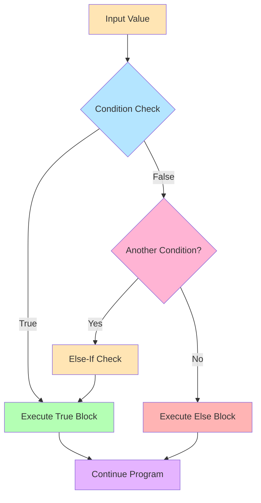
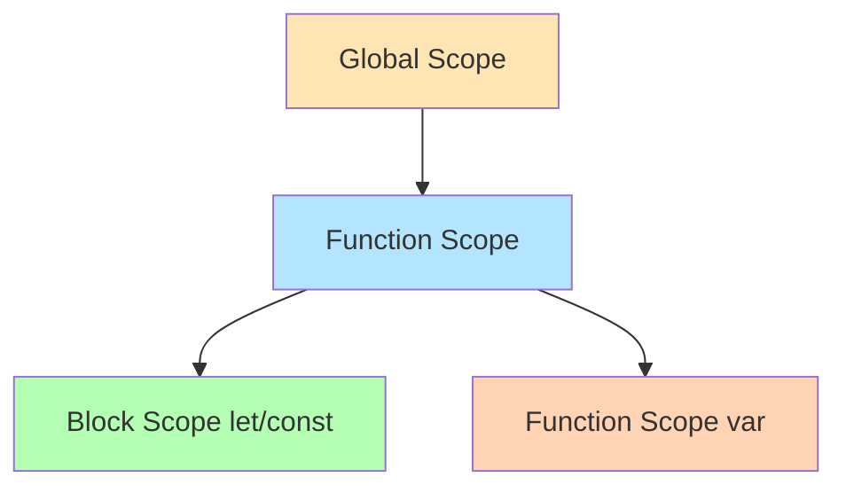
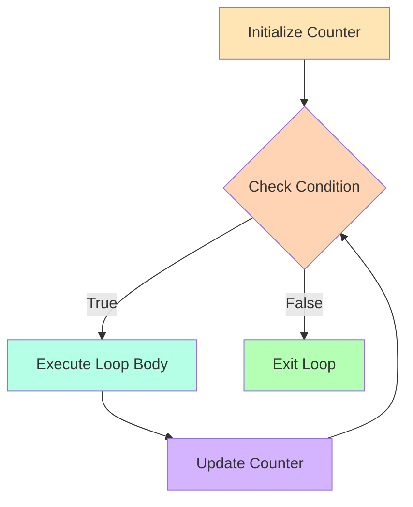
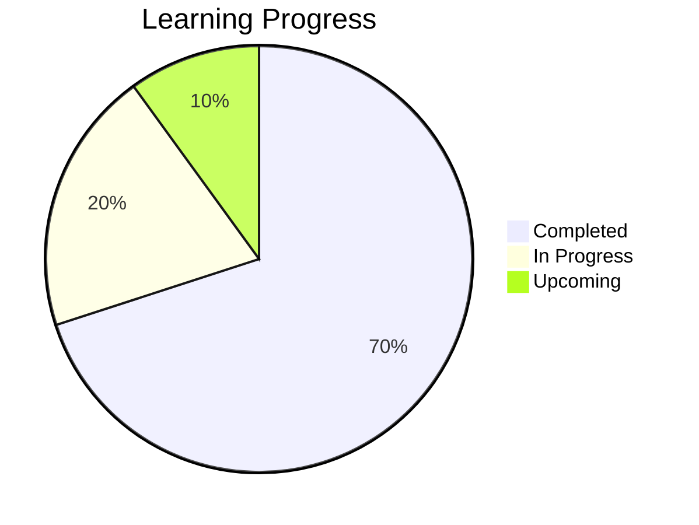

```mermaid
graph LR
    A[Introduction to JS] --> B[Setup & First Code]
    B --> C[Operators & Types]
    C --> D[Variables & Constants]
    D --> E[Decision Control]
    E --> F[Functions]
    F --> G[Loops]
    G --> H[Practice Projects]
    
    style A fill:#FFE5B4
    style B fill:#FFE5B4
    style C fill:#B4E5FF
    style D fill:#B4E5FF
    style E fill:#D4FFB4
    style F fill:#D4FFB4
    style G fill:#FFB4D4
    style H fill:#E5B4FF
```

<div align="center">

# 📚 Learning JavaScript - Complete Journey


*A comprehensive repository dedicated to mastering JavaScript from fundamentals to advanced concepts*

[🚀 Getting Started](#-getting-started) • [📖 Chapters](#-chapters-overview) • [🎯 Projects](#-practice-projects) • [📊 Progress](#-learning-progress)

</div>

---

## 📋 Table of Contents

- [Overview](#-overview)
- [Learning Path](#-learning-path)
- [Chapters Overview](#-chapters-overview)
- [Practice Projects](#-practice-projects)
- [Key Concepts Covered](#-key-concepts-covered)
- [Getting Started](#-getting-started)
- [Learning Progress](#-learning-progress)
- [Resources](#-resources)

---

## 🌟 Overview

This repository is my personal learning journey through JavaScript, featuring **hands-on code examples**, **practical exercises**, and **mini-projects** covering everything from basic syntax to advanced programming concepts.

### 🎯 Goals
- ✅ Master JavaScript fundamentals
- ✅ Understand ES6+ modern syntax
- ✅ Build interactive web applications
- ✅ Practice problem-solving with real-world scenarios
- ✅ Create a comprehensive reference library

---

## 🗺️ Learning Path



---

## 📖 Chapters Overview

### 📘 Chapter 0: Introduction to JavaScript
*Laying the foundation for JavaScript programming*
- Understanding JavaScript's role in web development
- Browser console basics
- JavaScript ecosystem overview

---

### 📗 Chapter 1: JS Setup and First Code
**File:** [`index.html`](Chapter%201(JS%20Setup%20and%20First%20Code)/index.html)

🔑 **Key Learnings:**
- ✨ Internal JavaScript embedding
- 🎨 DOM manipulation basics
- 🖱️ Event handling (`onclick`)
- 📝 User interaction with `prompt()`
- 🎯 Dynamic content updates

**Interactive Features:**
```javascript
✓ Button click events
✓ Background color changer
✓ Dynamic text modification
✓ Console logging
```

---

### 📙 Chapter 2: Arithmetic Operators and Types
**File:** [`script.js`](Chapter%202(Arithemetic%20Operator%20and%20Types)/script.js)

🔢 **Topics Covered:**
- ➕ Arithmetic operators (`+`, `-`, `*`, `/`, `%`)
- 🔤 String concatenation
- 🔄 Type coercion and conversion
- 📊 Data types (`string`, `number`, `boolean`, `null`, `undefined`)
- 🧮 `typeof` operator
- 🎲 Math operations and rounding

**Code Examples:**
```javascript
console.log(10 / 3);           // Floating point
console.log(Math.round(10/3)); // Rounding
console.log("Hello" + true);   // Type coercion
console.log(typeof(12));       // Type checking
```

---

### 📕 Chapter 3: Variables and Mini Project
**File:** [`index.html`](Chapter%203(Variables%20and%20MiniProject)/index.html)

💾 **Core Concepts:**
- 🔖 Variable declaration (`var`, `let`, `const`)
- 📏 Naming conventions (camelCase)
- 🔄 Variable reassignment
- 🔒 Constants (`const`)
- 🧪 Practical calculations

**Real-world Example:**
```javascript
const pi = 3.14;
let radius = 5;
let area = pi * radius * radius;
// Calculate circle area with different radii
```

---

### 📘 Chapter 4: Decision Control
**Files:** 8 comprehensive JavaScript files

<details>
<summary>📂 Click to expand all Decision Control topics</summary>

#### 1️⃣ [`comparison-operator.js`](Chapter%204(Decision%20Control)/comparison-operator.js)
- Comparison operators (`===`, `>=`, `<=`, `!=`)
- If-else statements
- Truthy and falsy values

#### 2️⃣ [`if-else-if.js`](Chapter%204(Decision%20Control)/if-else-if.js)
- Multi-condition branching
- Grade calculation system
- Nested conditions

#### 3️⃣ [`nested-if.js`](Chapter%204(Decision%20Control)/nested-if.js)
- Nested if statements
- Number classification (positive/negative, even/odd)

#### 4️⃣ [`logical.js`](Chapter%204(Decision%20Control)/logical.js)
- Logical operators (`&&`, `||`, `!`)
- Complex conditions
- Code optimization with logical operators

#### 5️⃣ [`switch.js`](Chapter%204(Decision%20Control)/switch.js)
- Switch-case statements
- Day of the week program
- Default cases

#### 6️⃣ [`if-alternatives.js`](Chapter%204(Decision%20Control)/if-alternatives.js)
- Ternary operator (`? :`)
- OR operator (`||`) for default values
- Nullish coalescing operator (`??`)

#### 7️⃣ [`template-literal.js`](Chapter%204(Decision%20Control)/template-literal.js)
- Template literals (backticks)
- String interpolation (`${expression}`)
- Multi-line strings

</details>

**Decision Making Flow:**


---

### 📗 Chapter 5: Functions
**Files:** 3 essential function concepts

| File | Concept | Key Learning |
|------|---------|--------------|
| [`function.js`](Chapter%205(Functions)/scripts/function.js) | Function basics | Declaration, parameters, return values, random number generation |
| [`call-by-value.js`](Chapter%205(Functions)/scripts/call-by-value.js) | Call by value | Primitive types passed by value |
| [`scope.js`](Chapter%205(Functions)/scripts/scope.js) | Variable scope | var vs let, hoisting, global vs local scope |

**Function Concepts:**
```javascript
// Function declaration
function getSum(num1, num2) {
  return num1 + num2;
}

// Variable scope
var x = 10;    // Function scoped
let y = 5;     // Block scoped
global = 22;   // Global scope
```

**Scope Hierarchy:**


---

### 📙 Chapter 6: Loops
**File:** [`loop.js`](Chapter%206(Loops)/scripts/loop.js)

🔁 **Loop Fundamentals:**
- While loop structure
- Loop initialization
- Condition checking
- Update/increment
- Iteration control

**Loop Structure:**
```javascript
let num = 1;              // ① Initialization
while (num <= 50) {       // ② Condition
  console.log(num);       // ③ Loop body
  num++;                  // ④ Update
}
```

**While Loop Flow:**


---

## 🎯 Practice Projects

### 🛍️ Project 1: Myntra Shopping Bag Counter
**Location:** [`Practice Question 1/`](Practice%20Question%201/)

<div align="center">


</div>

**📁 Files:**
- [`index.html`](Practice%20Question%201/index.html) - Main application
- [`style.css`](Practice%20Question%201/styles/style.css) - Styling
- [`Q1.txt`](Practice%20Question%201/Q1.txt) - Project description

**✨ Features:**
| Feature | Description | Implementation |
|---------|-------------|----------------|
| 🛒 Add to Bag | Increment counter by 1 | `x++` |
| ❤️ Move to Wishlist | Decrement counter by 1 | `x--` |
| 🎁 Add Sale Items | Increment counter by 2 | `x += 2` |
| 📊 Dynamic Display | Real-time bag count update | DOM manipulation |

**🎨 Design Highlights:**
- Clean and modern UI
- Color-coded buttons (aquamarine for add actions)
- Responsive button styling
- Real-time feedback

**Code Snippet:**
```javascript
let x = 0;
function addOne() {
    x++;
    document.getElementsByTagName('h1')[0]
        .innerText = `Your Bag has ${x} Items`;
}
```

---

## 🔑 Key Concepts Covered

<table>
<tr>
<td width="50%">

### 🎨 Frontend Basics
- ✅ HTML5 structure
- ✅ CSS3 styling
- ✅ DOM manipulation
- ✅ Event handling
- ✅ Interactive UIs

</td>
<td width="50%">

### 💻 JavaScript Core
- ✅ Variables & Constants
- ✅ Data types
- ✅ Operators (arithmetic, logical, comparison)
- ✅ Control structures
- ✅ Functions

</td>
</tr>
<tr>
<td width="50%">

### 🧠 Programming Concepts
- ✅ Conditionals (if/else/switch)
- ✅ Loops (while)
- ✅ Scope & Hoisting
- ✅ Type coercion
- ✅ Template literals

</td>
<td width="50%">

### 🔧 Modern JS Features
- ✅ ES6 syntax
- ✅ Ternary operators
- ✅ Nullish coalescing (`??`)
- ✅ Template strings
- ✅ Arrow functions (coming soon)

</td>
</tr>
</table>

---

## 🚀 Getting Started

### Prerequisites
- 🌐 Modern web browser (Chrome, Firefox, Edge, Safari)
- 📝 Code editor (VS Code recommended)
- 💡 Basic understanding of HTML/CSS (helpful but not required)

### Installation & Running

1️⃣ **Clone the repository:**
```bash
git clone https://github.com/yourusername/Learning-Js.git
cd Learning-Js
```

2️⃣ **Open any chapter:**
```bash
# Navigate to desired chapter
cd "Chapter 1(JS Setup and First Code)"
```

3️⃣ **Run the code:**
- Open `index.html` files directly in your browser
- Or use Live Server extension in VS Code
- For `.js` files, open browser console and run them

4️⃣ **Experiment:**
- Modify the code
- Test different values
- Break things and learn!

---

## 📊 Learning Progress



### ✅ Completed Chapters
- [x] Chapter 0: Introduction to JavaScript
- [x] Chapter 1: JS Setup and First Code
- [x] Chapter 2: Arithmetic Operators and Types
- [x] Chapter 3: Variables and Mini Project
- [x] Chapter 4: Decision Control
- [x] Chapter 5: Functions
- [x] Chapter 6: Loops (While Loop)

### 🔄 In Progress
- [ ] Chapter 6: Advanced Loops (for, do-while, for...of, for...in)
- [ ] Arrays and Array Methods
- [ ] Objects and Object-Oriented Programming

### 📅 Upcoming Topics
- [ ] ES6+ Features (Arrow Functions, Destructuring, Spread/Rest)
- [ ] Asynchronous JavaScript (Promises, Async/Await)
- [ ] DOM Advanced Manipulation
- [ ] Event Listeners and Event Delegation
- [ ] Local Storage and Session Storage
- [ ] Fetch API and AJAX
- [ ] Error Handling
- [ ] Modules and Import/Export
- [ ] Regular Expressions
- [ ] Data Structures (Maps, Sets)

---

## 📂 Repository Structure

```
Learning-Js/
│
├── 📖 README.md
├── 🚫 .gitignore
│
├── 📁 Chapter 0 (Introduction to JS)/
│
├── 📁 Chapter 1 (JS Setup and First Code)/
│   └── index.html
│
├── 📁 Chapter 2 (Arithmetic Operator and Types)/
│   └── script.js
│
├── 📁 Chapter 3 (Variables and MiniProject)/
│   └── index.html
│
├── 📁 Chapter 4 (Decision Control)/
│   ├── comparison-operator.js
│   ├── if-else-if.js
│   ├── nested-if.js
│   ├── logical.js
│   ├── switch.js
│   ├── if-alternatives.js
│   ├── template-literal.js
│   ├── index.html
│   └── including.html
│
├── 📁 Chapter 5 (Functions)/
│   ├── index.html
│   └── scripts/
│       ├── function.js
│       ├── call-by-value.js
│       └── scope.js
│
├── 📁 Chapter 6 (Loops)/
│   ├── index.html
│   └── scripts/
│       └── loop.js
│
└── 📁 Practice Question 1/
    ├── index.html
    ├── Q1.txt
    └── styles/
        └── style.css
```

---

## 🎓 Resources

### 📚 Reference Materials
- [MDN Web Docs - JavaScript](https://developer.mozilla.org/en-US/docs/Web/JavaScript)
- [JavaScript.info](https://javascript.info/)
- [W3Schools JavaScript Tutorial](https://www.w3schools.com/js/)

### 🛠️ Tools Used
- **Editor:** Visual Studio Code
- **Browser:** Chrome DevTools
- **Version Control:** Git & GitHub

---

## 💡 Tips for Learning

1. **🎯 Practice Daily:** Consistency is key - code every day, even if just for 30 minutes
2. **🐛 Debug Actively:** Use `console.log()` extensively to understand code flow
3. **🔨 Break Things:** Don't be afraid to modify code and see what happens
4. **📝 Take Notes:** Document your learnings and "aha!" moments
5. **🔄 Review Regularly:** Revisit previous chapters to reinforce concepts
6. **🚀 Build Projects:** Apply concepts in real mini-projects

---

## 🤝 Contributing

This is a personal learning repository, but suggestions and feedback are welcome! Feel free to:
- 🐛 Report issues
- 💡 Suggest improvements
- 🌟 Star the repository if you find it helpful

---

## 📜 License

This project is open source and available for educational purposes.

---

<div align="center">

### 🌟 Happy Coding! 🌟

**Made with ❤️ while learning JavaScript**


---

**📊 Stats:**


</div>
